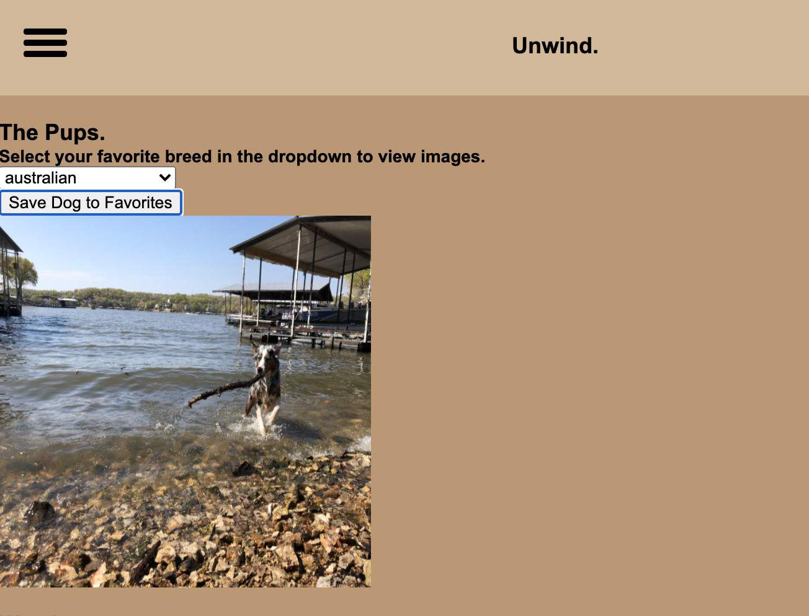
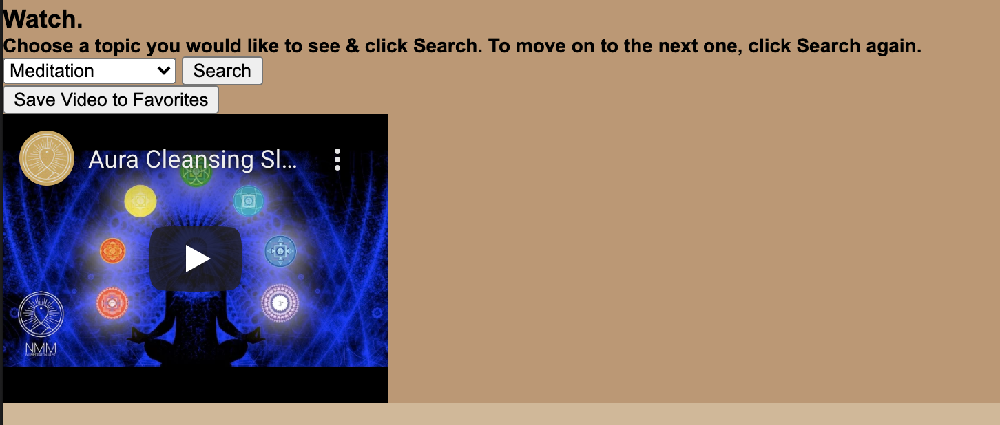
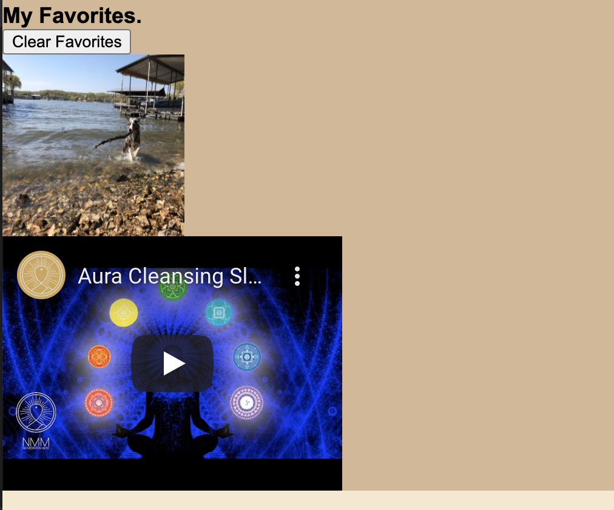
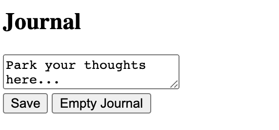
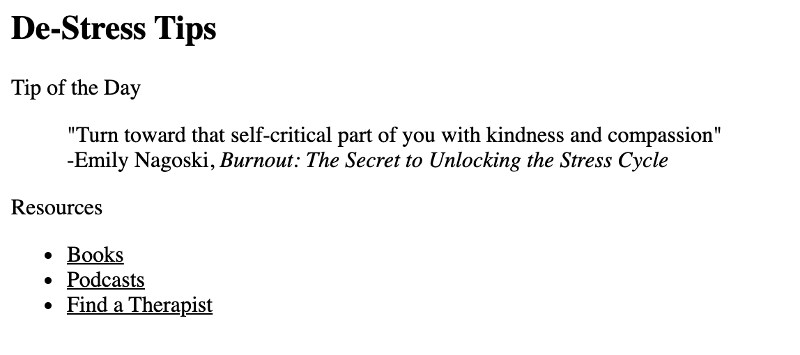

# destressor-app

NU Coding Bootcamp: "Unwind" Destressor App
<h1>Authors: @johnhumms, @haneennasereddin, @emilyalv</h1>
<h1>Contents</h1>
<ol>
<li><a href="#repository">The Repository</a></li>
<li><a href="#destressor-app">Destressor App</a></li>
<li><a href="#future-development">Future Development</a></li>
</ol>

<h1 id="repository">The Repository</h1>
The <code>destressor-app</code> repository contains HTML, CSS & JavaScript files for an app that is designed to be a central place for a user to access stress-relieving content. The app utilizes local storage to save a user's favorite content and display it on the page the next time the user visits. 

The destressor app accesses content from 2 APIs: the <a href="https://dog.ceo/dog-api/">Dog API</a> and the <a href="https://developers.google.com/youtube/v3">YouTube API</a>. When a user selects a dog breed within the app, an image of a dog of that breed is fetched and displayed on the page. When a user selects a video topic, an array of the top 10 videos on youtube matching the topic is fetched. A random video from the array is displayed on the page. 

<h1 id="destressor-app">Destressor App</h1>
Our Destressor App can be found here: <a href="https://emilyalv.github.io/destressor-app/.">https://emilyalv.github.io/destressor-app/.</a>

<h2>Dogs section</h2>

<h2>Video section</h2>

<h2>Favorites section</h2>

<h1 id="future-development">Future Development</h1>
Plans for future development include the addition of a journal page for reflection, meditation, or creative writing, as well as Tips section or page, where users can find additional stress relief and/or stress management strategies. 

 

